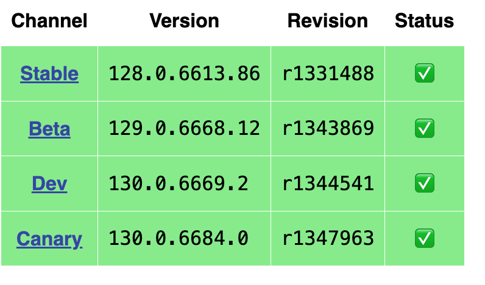

## Web Driver Installation

### Read the following instructions to install the Web Driver for Google Chrome

**Disclaimer**: The following instructions are for the Google Chrome Web browser. If you are using a different browser, please refer to the selenium 
documentation for different browser web drivers here: [https://www.selenium.dev/downloads/](https://www.selenium.dev/downloads/)

#### Step 1: Check your current version of Google Chrome
Look in the top left of your screen and find 'Chrome' and then 'About Google Chrome'

then, see which version you have. Notice that I currently have version 94. Your version might be different and that is ok. Just make sure you
know what you have.

#### Step 2: Install Google Chrome's Chromedriver
Go to this site: [Chrome for Testing Availability Dashboard](https://googlechromelabs.github.io/chrome-for-testing/)

Find the appropriate version of Chromedriver. I have Google Chrome version 94 installed so I will download Chromedriver version 94. 

Now I will choose the appropriate version of ChromeDriver for my operating system. I am on a Mac so I will choose **chromedriver_mac64.zip**

The resulting file that is downloaded will be zipped. 

#### Step 3: Move into your working directory

Unzip the file you just downloaded and move it into your working directory. In this workshop we are working in the ***PythonWebScraping-master*** folder. All you have to do is drag it in there. We will reference this file later in our code. 

