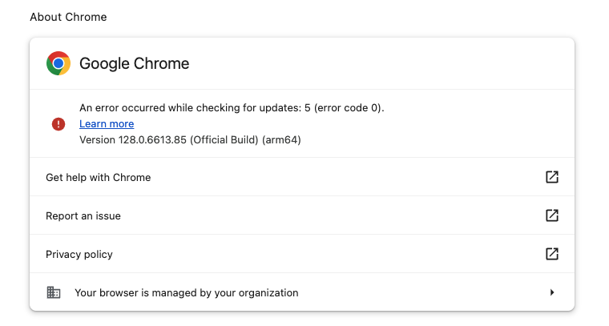
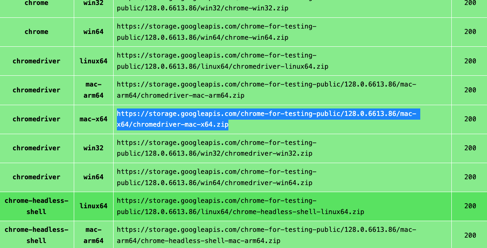

## Web Driver Installation

### Read the following instructions to install the Web Driver for Google Chrome

**Disclaimer**: The following instructions are for the Google Chrome Web browser. If you are using a different browser, please refer to the selenium 
documentation for different browser web drivers here: [https://www.selenium.dev/downloads/](https://www.selenium.dev/downloads/)

#### Step 1: Check your current version of Google Chrome
Look in the top left of your screen and find 'Chrome' and then 'About Google Chrome'

See which version you have. Notice that I currently have version 128. Your version might be different and that is ok. Just make sure you
know what you have.

#### Step 2: Install Google Chrome's Chromedriver
Go to this site: [Chrome for Testing Availability Dashboard](https://googlechromelabs.github.io/chrome-for-testing/)

Find the appropriate version of Chromedriver. I have Google Chrome version 128 installed so I will download Chromedriver version 128. 

Click **stable**

Now, under **binary**, look for **chromedriver**. 
Under **platform**, look for either Mac, Win (Windows), or Linux. Depending on your operating system, choose either **linux64, mac-x64, or win64**. 

Copy and paste the **URL** (as seen in the screenshot above) into a new browser tab and this will trigger a download in the Downloads folder on your computer. This folder will be zipped so you need to unzip it. 

#### Step 3: Move into your working directory

Unzip the files you just downloaded and move the **ChromeDriver** file into your working directory. In this workshop we are working in the ***PythonWebScraping-master*** folder. All you have to do is drag it in there. We will reference this file later in our code. 

